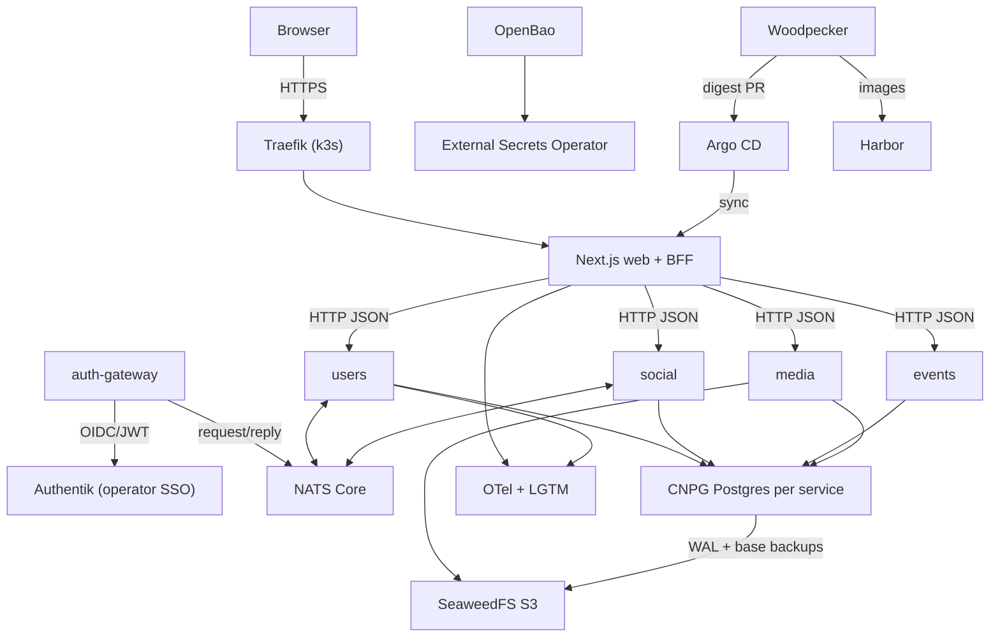
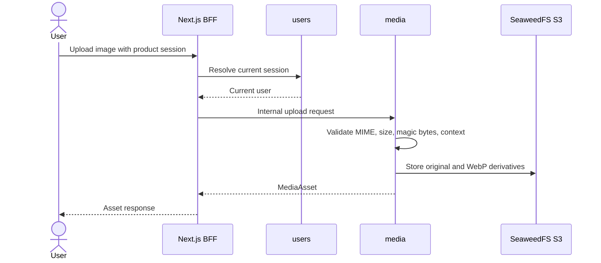

# Threshold Architecture

This is the current architecture summary. `AGENTS.md` is the source of truth for product scope and service ownership; this file describes how the pieces run and talk to each other.

## Runtime

Threshold runs on a single-node k3s cluster on the maintainer's home server. Manifests stay plain Kubernetes so a managed cluster can replace k3s later; no production cloud is provisioned yet.

Application workloads, all in namespace `threshold`:

- `apps/web`: Next.js app and BFF routes for browser-facing calls.
- `services/users`: product auth, sessions, profiles, Pages, follows, notifications, the canonical block registry, account erasure.
- `services/social`: groups, posts, comments, votes, emoji, Feed, reports, block enforcement for social flows.
- `services/media`: image validation, backend-owned object keys, WebP derivatives, S3 access.
- `services/events`: event CRUD, public event read model, posters, follow, boost, guestlist/check-in.
- `services/auth-gateway`: internal/admin SSO edge that validates Authentik tokens.

Platform:

| Concern | Component |
|---|---|
| Desired state | Argo CD app-of-apps, root Application `threshold-root` on `infra/argocd` in this repository, branch `main` |
| Manifests | Kustomize bases in `infra/kustomize/base`, one overlay `infra/kustomize/overlays/local`; Helm values in `infra/helm` |
| Ingress | Traefik bundled with k3s |
| Secrets | OpenBao (KV v2 mount `secret`) + External Secrets Operator through `ClusterSecretStore/openbao` |
| Images | Harbor, `core.harbor.domain/threshold/<service>` |
| CI | GitHub Actions for pull requests (`ci-ok`), Woodpecker for releases |
| Postgres | CloudNativePG, one cluster per service |
| Postgres backups | Barman Cloud plugin (`barman-cloud.cloudnative-pg.io`) with `ObjectStore` resources; needs cert-manager |
| Object storage | SeaweedFS S3 gateway |
| Messaging | NATS Core |
| TLS | cert-manager with a private LAN CA exposed as `ClusterIssuer/threshold-internal-ca` |
| DNS | AdGuard Home on the host rewrites private `.internal` names |
| Observability | OpenTelemetry Collector, Alloy, Loki, Tempo, Mimir, Grafana |

There is one Kustomize overlay, `local`. Separate staging and production overlays are deferred until there is a second environment to run them in.

Argo CD manages the application services and most of the platform (ESO, CNPG operator, cert-manager, Barman Cloud plugin, NATS, SeaweedFS, observability, Woodpecker). OpenBao, Harbor and Authentik run in the cluster but are installed and upgraded outside Argo CD.

## Component Layout

## Data And Trust Boundaries

- Browser traffic reaches services through `apps/web` BFF routes whenever cookies or internal tokens are involved.
- Services never join across each other's databases. Each service owns its CNPG cluster: `users-postgres`, `social-postgres`, `events-postgres`, `media-postgres`.
- Internal shared tokens stay server-side and come from OpenBao through ESO.
- Browsers never receive S3 credentials, bucket names or raw object keys.
- NATS Core carries request/reply and non-critical pub/sub. A flow that must not lose messages needs an outbox, retries and idempotent consumers before it relies on NATS.
- Every service has a `NetworkPolicy`. An HTTP caller must be listed in the callee's policy; a missing entry shows up as a timeout, not a 403.

## Service-To-Service Transports

Two transports are in use. Do not add a third.

| Transport | Flows |
|---|---|
| NATS request/reply | `users.current_profile.v1` (auth-gateway → users), `users.follow.list_following.v1` (social → users) |
| NATS pub/sub | `users.block.changed.v1` (users → social) |
| HTTP `/internal/v1/*` with `X-Threshold-Internal-Token` | everything else: notifications and mention lookups into users/events, Page membership and artist lookups (events → users), event announcements into social, account erasure from users into social/events/media |

Service ConfigMaps are loaded with `envFrom`, so a ConfigMap-only change needs a rollout restart. See `docs/release-and-deploy.md`.

## Authentication

- Product users register and sign in through Threshold's own UI. `users` owns credentials, password hashing, sessions, email verification, password reset, rate limiting and audit logs. The web BFF is the only browser-facing entry.
- Authentik is only for operator and admin SSO: Argo CD (OIDC), the OpenBao UI (Traefik forward auth) and `auth-gateway`. It is never the product login.
- Authentik runs from its Helm chart in namespace `authentik`, with its own CNPG cluster `authentik-postgres` and the shared Dragonfly cache (`dragonfly.infra.svc.cluster.local:6379`) instead of chart-bundled Postgres and Redis.

## Blocks

- `users` is the only writer of blocks.
- `social` keeps a local copy for enforcing blocks in social flows. It is fed by `users.block.changed.v1` and reconciled every 5 minutes against users `GET /internal/v1/blocks`, so a lost event is repaired within one interval.
- Do not create another block source of truth.

## Media

- `media` writes to bucket `threshold-media`. Only `media` generates object keys; clients never send a bucket or key.
- Keys: `assets/{uuid}/original` and `assets/{uuid}/derivatives/{variant}.webp`.
- `media` has its own S3 identity from OpenBao `threshold/media/s3`, materialized as `Secret/media-s3`. It never reuses the backup identity.
- A `MediaAsset` row records bucket, keys and variants only after validation and storage succeed.

## Backups

- Each service CNPG cluster archives WAL and takes a daily base backup through the Barman Cloud plugin to `s3://threshold-cnpg-backups/<cluster>`, with 14-day retention.
- All four clusters share one S3 identity, `cnpg-backup`, read from OpenBao `threshold/cnpg/users-postgres/s3`. Separation between clusters is by prefix, not by credential.
- The host also runs a Borg backup chain: daily `pg_dump` of every CNPG database plus Kubernetes/Helm exports, a weekly system tar that includes SeaweedFS, and a weekly CNPG restore gate. See `docs/runbooks/backup-restore.md`.
- Open question: old erasure notes assume 30-day backup retention, but the Borg archives keep monthly copies for about 6 months. This is unresolved.

## Email

`users` sends product-auth email (verification, password reset) through Resend SMTP at `smtp.resend.com:587` with STARTTLS. Host, port and security mode are in `users-config`. Credentials and sender settings belong in OpenBao `threshold/users/email`; no `ExternalSecret` for them is in `infra/` yet, so SMTP is off in the cluster (`smtp_enabled` defaults to false).

## Private DNS And TLS

- AdGuard Home on the host serves `.internal` rewrites (`threshold.internal`, `argocd.internal`, `grafana.internal`, `authentik.internal`, `openbao.internal`, `woodpecker.internal`). `.local` is avoided because of mDNS. Clients must use AdGuard as their resolver.
- cert-manager holds a private ECDSA root CA (`threshold-internal-ca`) and issues leaf certificates for the `.internal` hosts. Only the public root certificate is installed on clients. If the CA secret is lost, the root rotates and every client needs the new root.

## Product Rules That Shape The Architecture

- Anonymous access covers landing, auth, reset, verify and privacy routes plus direct event, user profile and Page detail pages. Feed, `/app/*`, the event catalog, groups, post permalinks and prototypes need a session.
- The chronological stream is called **Feed**. No ranking.
- Event location modes in use are `public_location` and `tba`. `secret_location` exists in the model but create/update rejects it until the encrypted-reveal work lands.
- Cursor helpers stay local to `social` and `events`: `events` uses URL-safe base64 timestamp cursors, `social` uses `created_at|id` cursors. They are different enough that a shared helper in `libs/py` would not help.

## Deployment

Releases are tag-driven and promote image digests into `infra/` through a pull request; Argo CD syncs after the merge. Database migrations run as Argo CD `Sync` hook Jobs. See `docs/release-and-deploy.md`.
